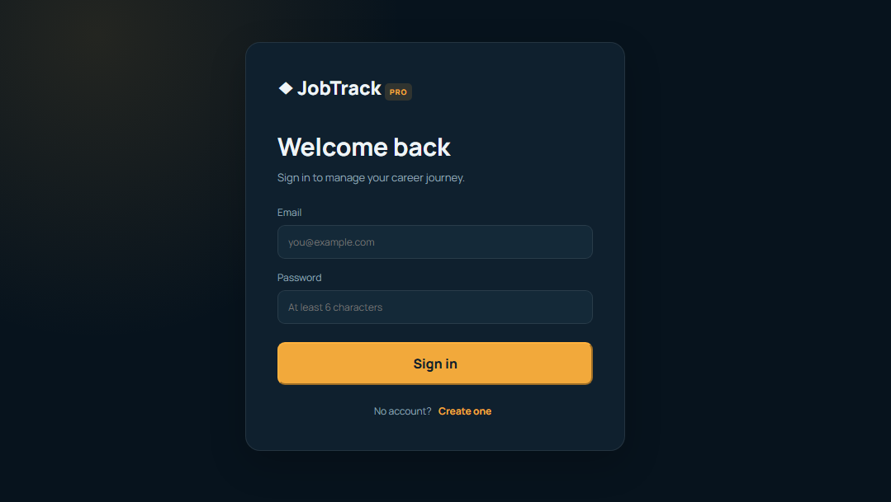
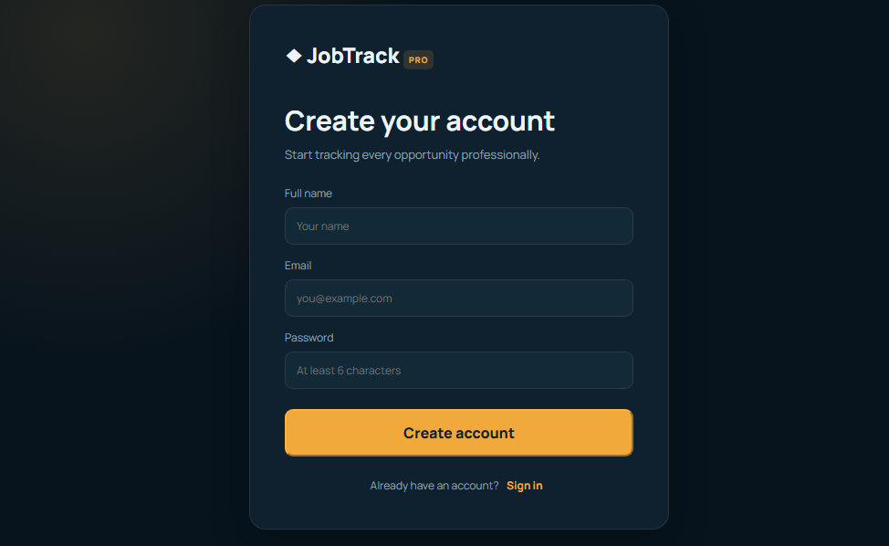
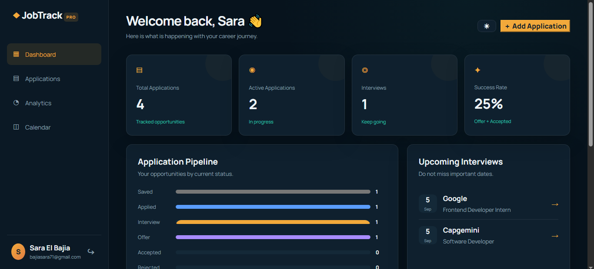
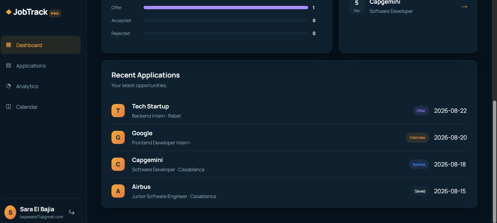
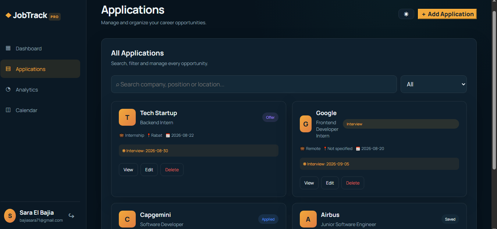
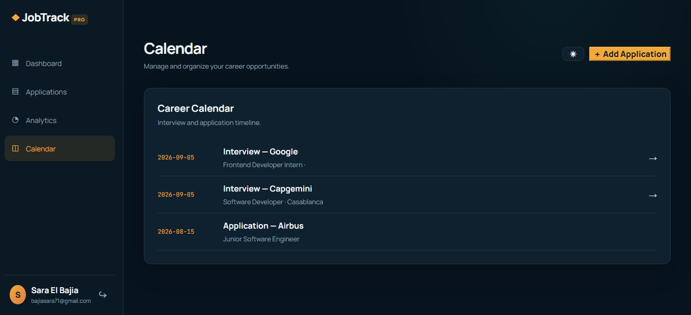
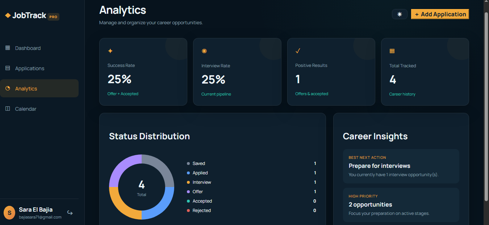
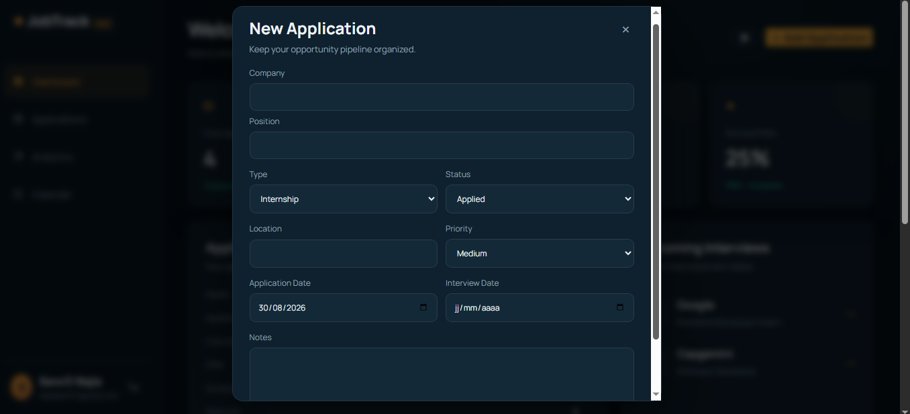

# JobTrack Application

Application full-stack de suivi des candidatures d'emploi, développée avec **C#/.NET**, **MySQL**, et **React**.

## 📌 Description

JobTrack est une application web permettant aux utilisateurs de gérer et suivre leurs candidatures d'emploi de manière centralisée.

Elle offre une interface sécurisée (authentification JWT) et un tableau de bord clair pour suivre l'évolution de chaque candidature.

## ✨ Fonctionnalités

- 🔐 Authentification sécurisée (Inscription / Connexion via JWT)
- 📋 Ajout, modification et suppression des candidatures
- 🔍 Recherche et filtrage des candidatures
- 📊 Suivi du statut de chaque candidature
- 📅 Calendrier des candidatures
- 📈 Tableau de bord avec statistiques (Analytics)
- 🗄️ Stockage des données via MySQL
- 🎨 Interface utilisateur moderne avec React

## 🛠️ Technologies utilisées

| Technologie | Utilisation |
|---|---|
| C# / ASP.NET Core | API Backend |
| Entity Framework Core | ORM / Accès aux données |
| MySQL | Base de données |
| JWT | Authentification et sécurité |
| React | Interface utilisateur (Frontend) |
| Docker / docker-compose | Conteneurisation du projet |
| Git / GitHub | Gestion des versions |

## 🏗️ Architecture

Le projet est structuré en deux parties principales :

- **backend/** : API RESTful développée avec ASP.NET Core, contenant les Controllers, Models, et le DbContext (Entity Framework)
- **frontend/** : Application React consommant l'API backend

## 🗄️ Base de données

L'application utilise MySQL pour stocker les données relatives aux :

- 👤 Utilisateurs (authentification)
- 📋 Candidatures (Applications)

🔒 Les informations sensibles de connexion à la base de données ne sont pas publiées dans ce repository.

## 🔐 Sécurité

La protection des informations sensibles constitue un élément important du projet.

Les informations de connexion à la base de données et la clé JWT ne doivent pas être publiées sur GitHub.

Le fichier `appsettings.json` contient uniquement des valeurs d'exemple ; la configuration réelle est définie localement dans un fichier `appsettings.Development.json`, exclu du repository via `.gitignore`.

## 🖥️ Captures d'écran

### 🔐 Connexion



### 📝 Création de compte



### 📊 Tableau de bord





### 📋 Candidatures



### 📅 Calendrier



### 📈 Analytics



### ➕ Nouvelle candidature



## 🚀 Installation

### Prérequis

- Windows
- .NET SDK
- Node.js
- MySQL Server
- Docker (optionnel, via docker-compose)

### 1. Cloner le repository
git clone https://github.com/SaraBajia/Jobtrack_Application.git

### 2. Configurer le backend

cd backend
dotnet restore
dotnet run

### 3. Configurer le frontend

cd frontend
npm install
npm run dev

### 4. (Optionnel) Lancer avec Docker

docker-compose up

## 📁 Organisation du projet
```
JobTrack_Application/
│
├── backend/
│   ├── Controllers/
│   ├── Data/
│   ├── Models/
│   ├── Program.cs
│   └── appsettings.json
│
├── frontend/
│   ├── src/
│   └── package.json
│
├── database/
│   └── jobtrack_mysql.sql
│
├── screenshorts/
├── docker-compose.yml
├── .gitignore
└── README.md
```
## 🎯 Objectifs du projet

- Centraliser le suivi des candidatures d'emploi dans une interface unique ;
- Offrir une authentification sécurisée aux utilisateurs ;
- Faciliter le suivi du statut de chaque candidature ;
- Proposer une architecture claire séparant backend et frontend ;
- Appliquer les bonnes pratiques de sécurité (gestion des secrets via variables d'environnement).

## 👩‍💻 Auteur

Sara El Bajia

Projet full-stack de gestion de suivi de candidatures.

⭐ Merci de visiter ce projet !
